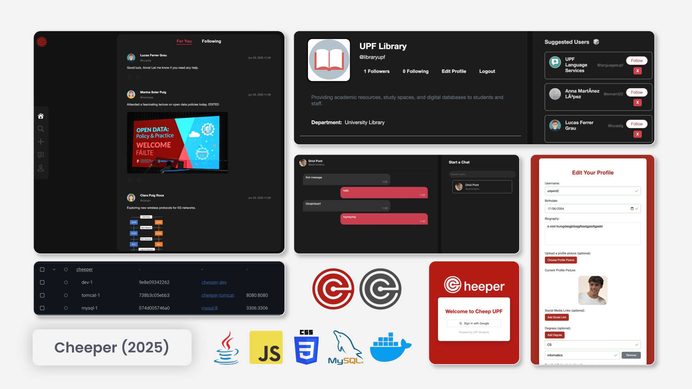

 

---

<p align="center">
  
</p>

# Cheeper, a Twitter-like webapp platform in Java

#### A project for the **UPF - Software Engineering for Web Applications** course, 2025

**Cheeper** is a Twitter-like social media application built using Java EE technologies: Servlets, JPC and JavaBeans under MVC2 design pattern.




This is clearly reflected in the project structure, which separates the application code into distinct layers:

```plaintext
src/
├── main/
    ├── java/com/webdev/cheeper/
    │   ├── controller/    # Servlet classes for handling requests
    │   ├── model/         # Domain entities
    │   ├── repository/    # Data access layer
    │   ├── service/       # Business logic layer
    │   └── util/          # Helper classes
    └── webapp/
        ├── static/       # Publicly accessible static resources
        │   ├── css/
        │   ├── js/
        │   └── images/
        └── WEB-INF/      # Protected web resources, redirected from servlets
            ├── views/    # JSP view templates
            └── web.xml   # Web application config
```

## Full functionality walkthrough

https://github.com/user-attachments/assets/35bff980-33c3-4a8e-912a-d5a9e75b28a7

## Test it yourself: Dev Container setup for Java/Tomcat/Maven

### Motivation

We spent a *non-negligible* amount of time setting up with local Java/Tomcat/Maven setups and interiorizing IDE-specific GUI flows. We wanted to let every teammate use **any IDE** (VS Code, IntelliJ,...) against a single, reproducible environment, with the minimum amount of local installs.

### Devcontainer Architecture Overview

Our project uses Docker Compose to orchestrate three separate services. We settled on using a devcontainer, which is an open standard for defining a development environment in a Docker container. The first service, `dev`, is our development environment container. We just have to set up a single Dockerfile, and then we can use it in any IDE that supports devcontainers: they can "mount" the local filesystem into the container and integrate the whole IDE experience, providing a transparent experience as if it was running locally on the host machine. It includes OpenJDK 21, the Maven CLI, Git, and other essential devtools for our Java EE2 stack.

The second service, `tomcat`, runs the official Tomcat 11 server. We extend the base image with a small customization so that Tomcat rescans the deployment directory more often, allowing faster "hot-deploy" when a new WAR file is built. Deployments happen automatically: when a fresh `ROOT.war` is placed into a shared `webapps` folder, Tomcat detects the change and reloads the application. Note that there is a bit of edge-case handling using a container-bind mount directory (`tomcat-webapps`) to ensure that the `webapps` folder on the server is always empty before a new deployment, to trigger the reload. We have set up, as explained later, a build script to handle this process using a single command.

The third service, `db`, runs MySQL 8 to host the application’s database. The folder `.devcontainer/mysql-init` contains the SQL scripts that will be executed on image build in order to set up the database schema and some initial sample data.

 All credentials and configuration values are stored in a single `.env` file at the repository root for simplicity and consistency. This file is then used to configure the system environment variables for all three services. For simplicity, and given that we have control over the three containers, we set up all environment variables from the `.env` file on all three containers.

### Getting Started

1. **Install Docker** and the **VS Code Dev Containers** extension (or the desired IDE’s equivalent).  
2. **Clone the repository and open it in VS Code**.
3. **Open the Command Palette** (Ctrl+Shift+P) and select **Dev Containers: Reopen in Container**.
4. **Wait for the container to build** (it may take a few minutes the first time).

### Running the Application

The build and deploy process can be run in two ways:

1. **Using VSCode Build Task**:
   - Open Command Palette (Ctrl+Shift+P) and select **Tasks: Run Build Task**
   - Or use the shortcut **Ctrl+Shift+B** (Windows/Linux)/**Cmd+Shift+B** (Mac)

2. **Using Terminal**:
   - Run the build script directly: `./build.sh`

Both methods will build the project into a `.war` file under `/target` and deploy it to the Tomcat server. The application will be available at `http://localhost:8080/` after a few seconds (enough for Tomcat to detect the new `.war` file, explode it into a folder, and start serving from it).

### Connecting to the Database

To verify that the MySQL service is up and reachable from all three layers:

1. **From the Host computer running the containers (CLI)**
   Use the server credentials to connect over TCP to `127.0.0.1:3306`:

   ```bash
   mysql \
     --protocol=TCP \
     --host=127.0.0.1 \
     --port=3306 \
     --user="${DB_DEV_USER}" \
     --password="${DB_DEV_PASS}" \
     "${MYSQL_DATABASE}"
   ```

   Manually write the user and password values that we want to test against, as found on the `.env` file. Using the `${VAR}` syntax will not work here if these variables haven't been previously exported to the host's system environment.

2. **From inside the "Dev" service Container**

   * **Via VS Code’s MySQL Extension**

     1. Open the **Database Explorer** (cylinder icon).
     2. Select **+ Add Connection**, then enter:

        * **Host**: `${DB_HOST}`
        * **Port**: `3306`
        * **Username**: `${DB_DEV_USER}`
        * **Password**: `${DB_DEV_PASS}`
        * **Database**: `${MYSQL_DATABASE}`
     3. Click **Connect**, and wait for the connection to be established.

    Again, manually write the values as found on the `.env` file. Using the `${VAR}` syntax will not work here since we are on an extension config window inside VS Code.

   * **Via CLI**

     ```bash
     mysql \
       --host=${DB_HOST} \
       --port=3306 \
       --user="${DB_DEV_USER}" \
       --password="${DB_DEV_PASS}" \
       "${MYSQL_DATABASE}"
     ```
    
    In this case, the `${VAR}` syntax will work, as we are inside the container and the variables are set in the environment.

3. **From the Tomcat Server (Health-Check Servlet)**
   Hit the health endpoint from the browser or using `curl`:

   ```bash
   curl -i http://localhost:8080/health
   ```

   * **200 OK** with a green “Connected to …” message means it worked.
   * **500** and an error page if the JDBC (client library to establish a connection to the database) connection failed.

### Using Environment Variables Outside Containers

When deploying to different environments outside the compose's dev containers, the environment variables that the code uses need to be set up on the machine that runs it. The `.env` file contains all necessary configuration, but these variables need to be exported to the local environment.

We've provided a script to streamline this process: `setup-env.sh`:

```bash
# Make the script executable
chmod +x setup-env.sh

# Source the script to export variables to your current shell
source setup-env.sh
```
