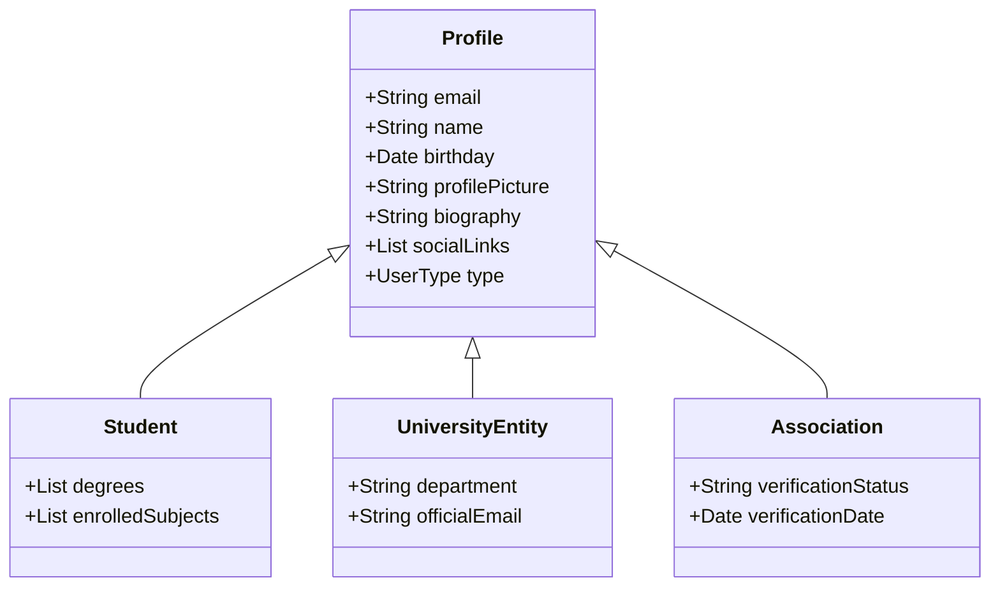
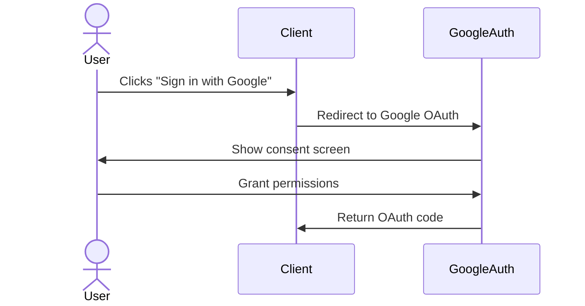
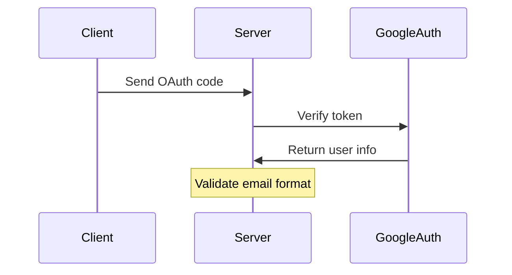
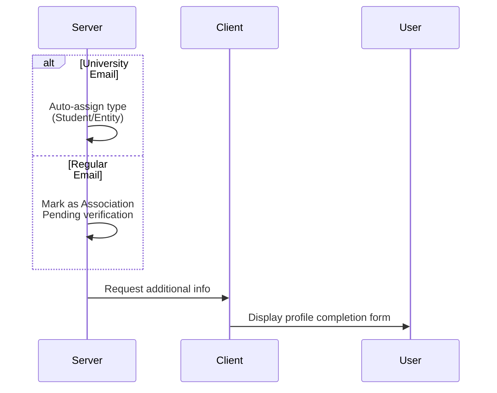
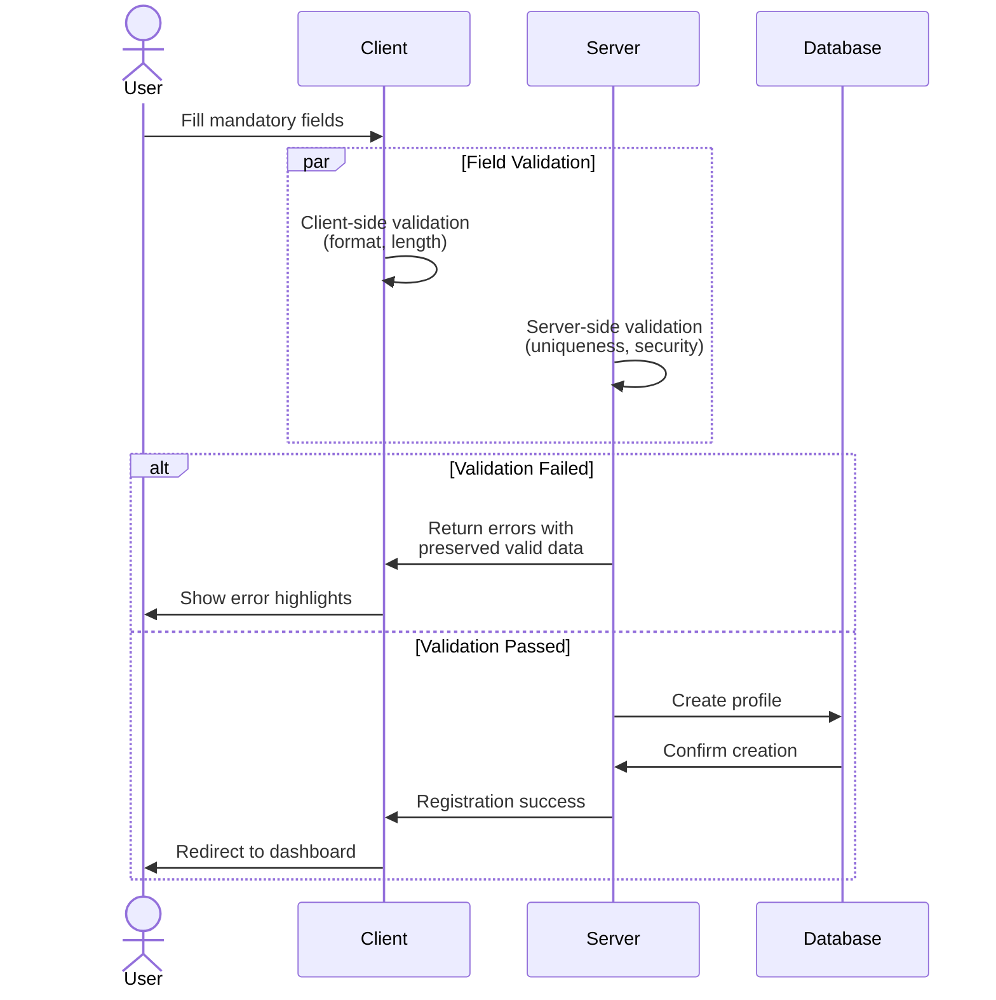

## Profile Type Structure

## OAuth Google Sign-in Registration Process

### 1. Initial OAuth Authentication

### 2. Token Verification and User Info Retrieval

### 3. User Type Classification

### 4. Profile Validation and Creation

