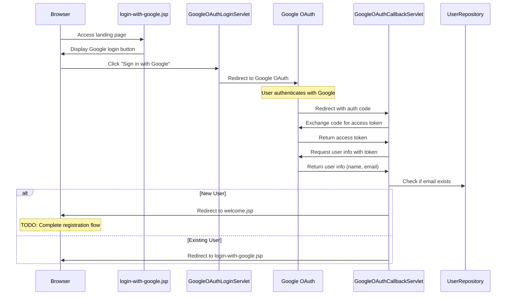

# OAuth2 Flow Documentation

## Current Implementation Status

The OAuth2 authentication flow is partially implemented, with the following components working:

1. Initial Login Page ✅
   - Landing page with Google sign-in button
   - Static resources (CSS, images) properly loaded

2. OAuth2 Initialization ✅
   - Redirect to Google OAuth page
   - Proper configuration of client ID and redirect URI
   - Request for email and profile scopes

3. OAuth2 Callback Processing ✅
   - Receiving authorization code from Google
   - Exchange code for access token
   - Fetch user information (name, email)
   - Session storage of basic user data

4. Basic Email Check ✅
   - Check if email exists in database
   - Basic routing based on email existence

## Current Flow Diagram

## Pending Implementation (into repository)

1. User Registration Flow
   - Welcome page form submission
   - Integration with UserService for validation
   - User creation in database

2. User Validation Layer

3. Database Integration
   - User creation with all required fields
   - Proper error handling for database operations
