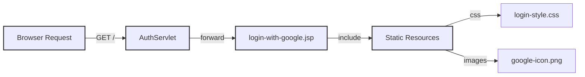

# Cheeper Project Structure

## Directory Overview

```
src/
├── main/
    ├── java/com/webdev/cheeper/
    │   ├── controller/     # Servlet classes for handling HTTP requests
    │   ├── model/         # Domain entities
    │   ├── repository/    # Data access layer
    │   ├── service/       # Business logic layer
    │   └── util/          # Helper classes
    └── webapp/
        ├── static/       # Publicly accessible static resources
        │   ├── css/
        │   └── images/
        └── WEB-INF/      # Protected web resources, redirected from servlets
            ├── views/    # JSP view templates
            └── web.xml   # Web application config
```

## Landing page request flow



- No index.jsp or index.html is used, instead the root URL is handled by `AuthServlet` that forwards to `login-with-google.jsp` view template.