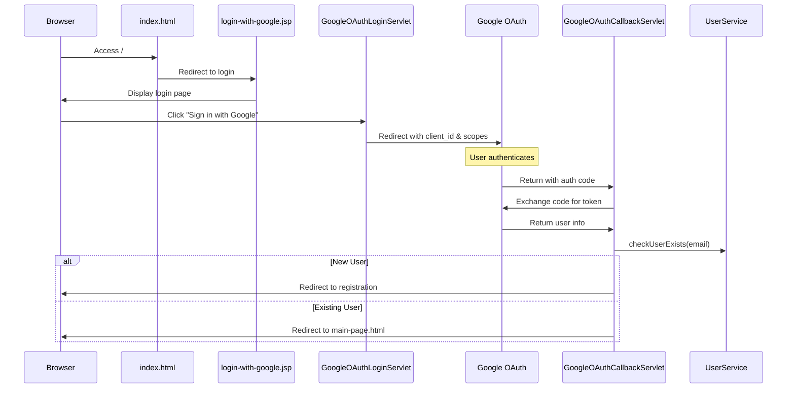
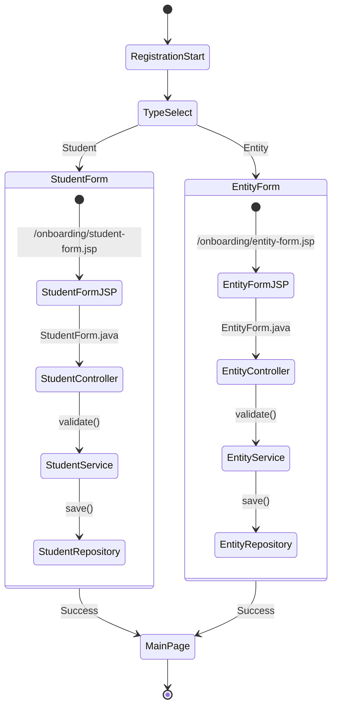

# Sign in and Sign up flow

## OAuth flow

```mermaid
sequenceDiagram
    participant B as Browser
    participant I as index.html
    participant LG as login-with-google.jsp
    participant GOLS as GoogleOAuthLoginServlet
    participant G as Google OAuth
    participant GOCS as GoogleOAuthCallbackServlet
    participant US as UserService
    
    B->>I: Access /
    I->>LG: Redirect to login
    LG->>B: Display login page
    B->>GOLS: Click "Sign in with Google"
    GOLS->>G: Redirect with client_id & scopes
    Note over G: User authenticates
    G->>GOCS: Return with auth code
    GOCS->>G: Exchange code for token
    G->>GOCS: Return user info
    GOCS->>US: checkUserExists(email)
    alt New User
        GOCS->>B: Redirect to registration
    else Existing User
        GOCS->>B: Redirect to main-page.html
    end
```

## Registration flow

```mermaid
stateDiagram
    [*] --> RegistrationStart
    RegistrationStart --> TypeSelect
    
    TypeSelect --> StudentForm: Student
    TypeSelect --> EntityForm: Entity
    
    state StudentForm {
        [*] --> StudentFormJSP: /onboarding/student-form.jsp
        StudentFormJSP --> StudentController: StudentForm.java
        StudentController --> StudentService: validate()
        StudentService --> StudentRepository: save()
    }
    
    state EntityForm {
        [*] --> EntityFormJSP: /onboarding/entity-form.jsp
        EntityFormJSP --> EntityController: EntityForm.java
        EntityController --> EntityService: validate()
        EntityService --> EntityRepository: save()
    }
    
    StudentForm --> MainPage: Success
    EntityForm --> MainPage: Success
    MainPage --> [*]
```
