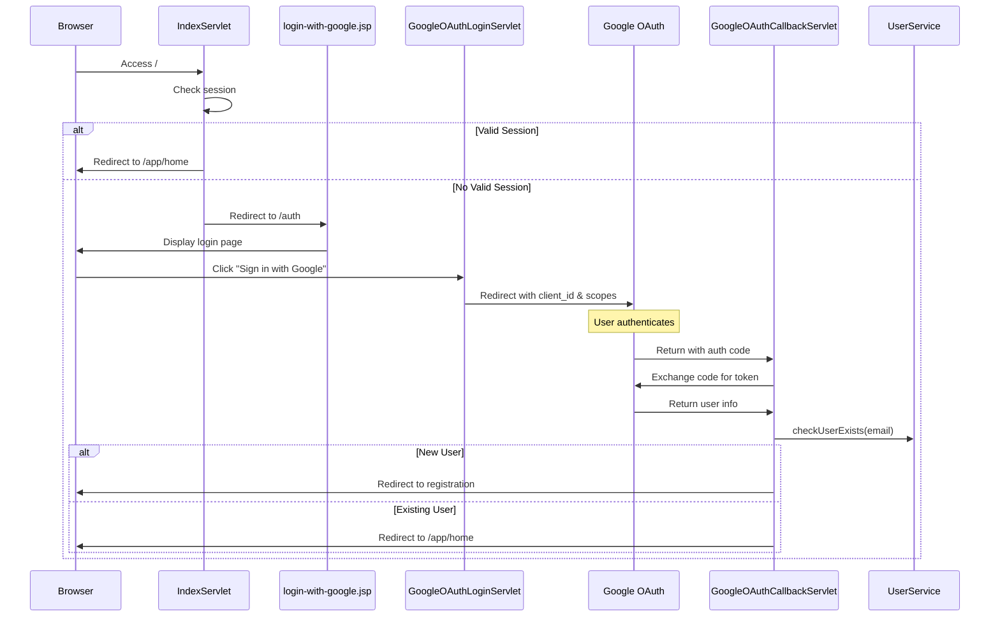
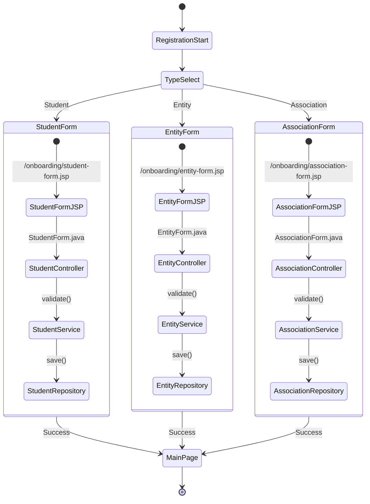

# Sign in and Sign up flow

## OAuth flow

## Registration flow

## Session management

The application uses Jakarta EE's `HttpSession` for managing user sessions
- Stores user information:
    - name: User's full name
    - email: User's email address
    - role: User's role type (STUDENT/ENTITY/ASSOCIATION)
- All protected routes check for valid session
