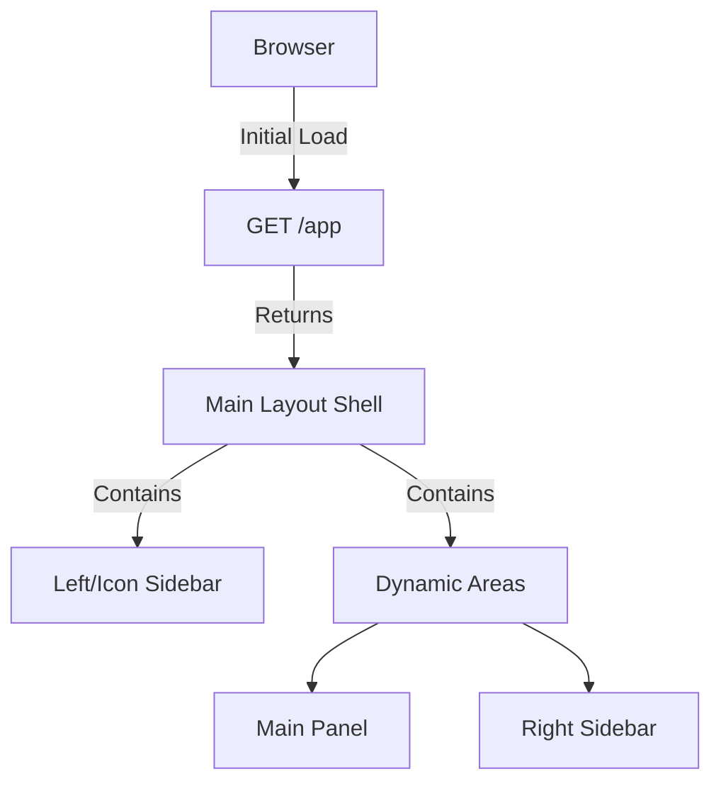

# View Architecture in Cheeper

## Single Page Application Structure

Cheeper implements a SPA (Single Page Application) approach with a fixed shell layout and dynamically loaded content from a set of reusable view templates, similar to Twitter's design.



## Directory Structure
```
src/main/webapp/WEB-INF/views/
├── components/             # Reusable view templates
│   ├── profile-view.jsp
│   ├── timeline-view.jsp
│   ├── users-list-view.jsp
│   ├── create-post-view.jsp
│   ├── post-view.jsp
│   └── chats-view.jsp
└── layouts/
    └── main-layout.jsp

src/main/webapp/static/css/  # Component-specific styles
├── main-page.css
├── profile.css
└── ...

src/main/java/com/webdev/cheeper/controller/views/
├── ProfileViewController.java
├── TimelineViewController.java
└── ...
```


## Component Architecture

Each view template "component" in Cheeper follows a modular architecture:

1. **View Template (JSP)**
   - Located in `components/`
   - Contains only markup and basic display logic
   - Uses class names for styling
   - Focuses on presentation

2. **View Controller**
   - Located in `controller/views/`
   - Handles business logic for its specific view
   - Manages authentication and authorization
   - Prepares data for the view
   - Sets view state based on context, to be rendered by the JSP template

3. **Component CSS**
   - Located in `static/css/`
   - Component-specific styles
   - Loaded once on main-layout.jsp
   - Scoped to component's root class
   - Available client-side for dynamic content

### Example: Profile view Ccmponent

```
profile-view.jsp             # Markup template
profile.css                  # Scoped styles (.profile-view {})
ProfileViewController.java   # Business logic & data preparation
```

When a profile is requested:
1. Client requests `/views/profile`
2. ProfileViewController:
   - Validates session
   - Loads appropriate profile data
   - Sets view attributes
3. profile-view.jsp renders with data, returned to the client to be displayed on the `main-layout.jsp`'s main panel/side panel
4. Styles from profile.css (already loaded) apply
