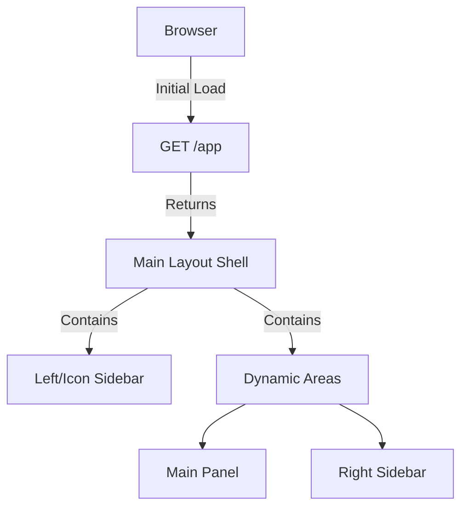
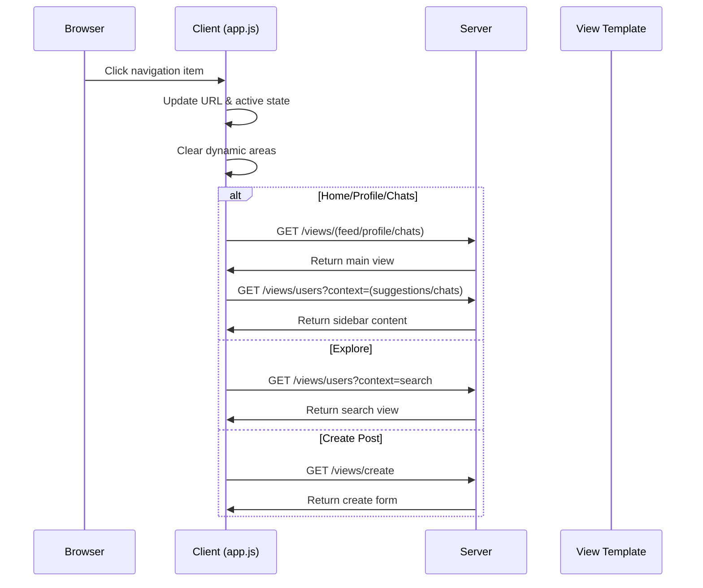
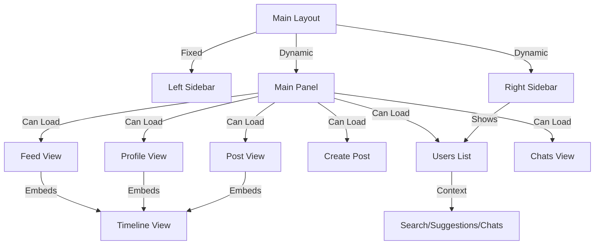

# View Architecture in Cheeper

## Single Page Application Structure

Cheeper implements a SPA (Single Page Application) approach with a fixed shell layout and dynamically loaded content from a set of reusable view templates, similar to Twitter's design.



## Directory Structure
```
src/main/webapp/WEB-INF/views/
├── components/             # Reusable view templates
│   ├── feed-view.jsp      # Feed container with tabs
│   ├── profile-view.jsp   # Profile display
│   ├── timeline-view.jsp  # Universal timeline
│   ├── users-list-view.jsp# User listings
│   ├── create-post-view.jsp# Post creation form
│   ├── post-view.jsp      # Individual post display
│   └── chats-view.jsp     # Chat interface
└── layouts/
    └── main-layout.jsp    # SPA container
```

## View Templates

All views are served through the `/views/*` endpoint by ViewsController, with components designed for reuse and composition.

### Timeline View Component
The timeline-view.jsp is a universal component for displaying posts that gets reused across different contexts:
- Within feed-view.jsp for showing For You/Following feeds
- Within profile-view.jsp for showing a user's posts
- Within post-view.jsp for showing comments
- Each context passes appropriate parameters to configure the timeline's behavior

### Feed View
- **Template**: `feed-view.jsp`
- **Endpoint**: `GET /views/feed`
- **Responsibility**: Displays feed tabs and embeds timeline
- **Composition**: Loads timeline-view with appropriate context

### Profile View
- **Template**: `profile-view.jsp`
- **Endpoint**: `GET /views/profile`
- **Responsibility**: Displays user profile with timeline
- **Composition**: Embeds timeline-view for user's posts

### Timeline View
- **Template**: `timeline-view.jsp`
- **Endpoint**: `GET /views/timeline`
- **Parameters**:
  - `type`: for-you | following | profile | comments
  - `userId`: (optional) for profile timeline
  - `postId`: (optional) for comments timeline
- **Responsibility**: Universal post listing component

### Users List View
- **Template**: `users-list-view.jsp`
- **Endpoint**: `GET /views/users`
- **Parameters**: 
  - `context`: search | suggestions | chats
- **Responsibility**: Displays user lists for various contexts

### Create Post View
- **Template**: `create-post-view.jsp`
- **Endpoint**: `GET /views/create`
- **Responsibility**: Post creation form

### Post View
- **Template**: `post-view.jsp`
- **Endpoint**: `GET /views/post`
- **Parameters**: 
  - `id`: post identifier
- **Responsibility**: Single post with comments
- **Composition**: Embeds timeline-view for comments

### Chats View
- **Template**: `chats-view.jsp`
- **Endpoint**: `GET /views/chats`
- **Responsibility**: Chat interface split into conversations list and message area
- **Composition**: Works with users-list-view for contacts list

## View Loading and Composition

### Client-Side Navigation


### View Composition


Views are loaded dynamically via AJAX calls through app.js's loadView function:
```javascript
function loadView(view, params = {}, targetContainer = '#main-panel') {
    // Construct query string from params
    const queryString = Object.keys(params)
        .map(key => `${key}=${params[key]}`)
        .join('&');
        
    $.ajax({
        url: `/views/${view}${queryString ? '?' + queryString : ''}`,
        method: 'GET',
        success: function(response) {
            $(targetContainer).html(response);
        }
    });
}
