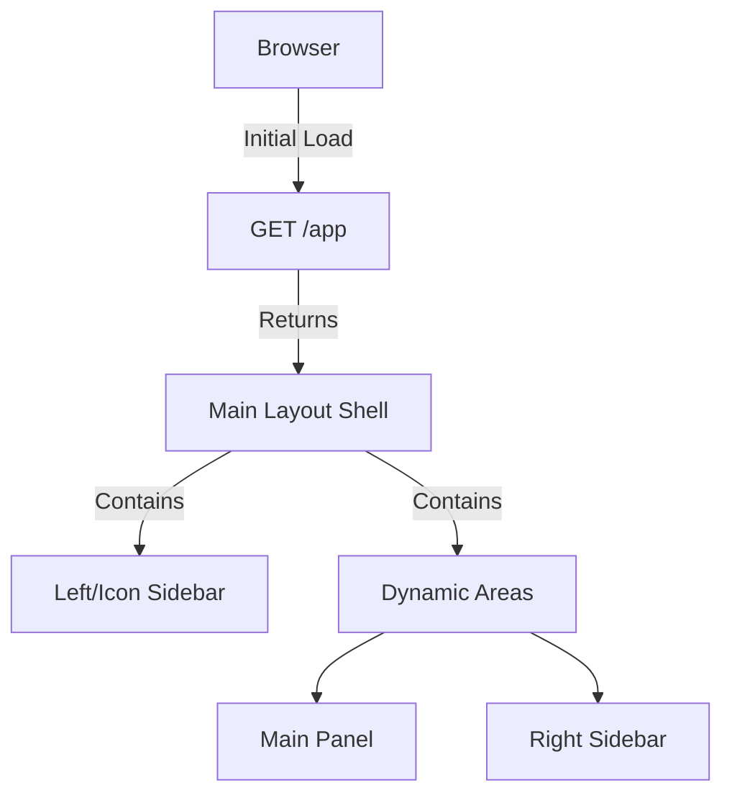
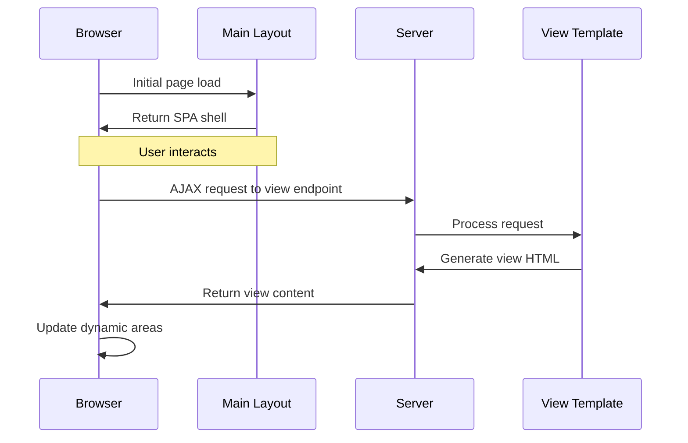

# View Architecture in Cheeper

## Single Page Application Structure

Cheeper implements a SPA (Single Page Application) approach with a fixed shell layout and dynamically loaded content from a set of reusable view templates, similar to Twitter's design.



## Directory Structure
```
src/main/webapp/WEB-INF/views/
├── components/        # Reusable view templates
│   ├── profile-view.jsp   # Profile display
│   └── timeline-view.jsp  # Universal timeline
└── layouts/
    └── main-layout.jsp    # SPA container
```

## View Templates

### Profile View
- **Template**: `profile-view.jsp`
- **Endpoint**: `GET /views/profile?username=X`
- **Responsibility**: Displays user profile information

### Timeline View
A universal template for displaying post collections with different data sources.

- **Template**: `timeline-view.jsp`
- **Multiple Endpoints**:
  ```
  GET /feed/for-you        → Global feed
  GET /feed/following      → Following feed
  GET /profile/timeline    → User's posts, to be used in profile view
  ```

## View Loading


